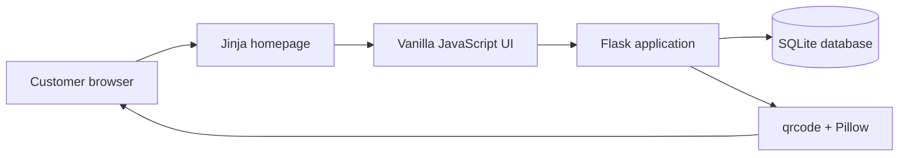

# FreshCart: Indian Online Grocery Store

FreshCart is a full-stack Indian grocery shopping application. Customers can browse Indian grocery products, search and filter the catalog, add products to a cart, create an account, save delivery details, complete a simulated UPI payment, place orders, and track their order history.

This README describes the application as it exists currently.

## 1. Current Technology Stack

| Area | Technology | Current use |
|---|---|---|
| Programming language | Python 3.12 | Backend application logic |
| Web framework | Flask 3.1 | HTTP routes, sessions, JSON APIs, and page rendering |
| Frontend templates | Jinja2 | Server-rendered homepage and user data injection |
| Frontend | HTML5, CSS3, vanilla JavaScript | Layout, styling, dialogs, cart, checkout, and account interactions |
| Database | SQLite | Products, users, orders, and order items |
| Authentication | Flask sessions and Werkzeug password hashing | Signup, login, logout, and protected user actions |
| QR generation | `qrcode` 8.2 and Pillow | Server-generated UPI-style payment QR image |
| Testing | pytest 8.3 | Backend route and business-logic tests |
| Runtime | Flask development server / Gunicorn | Local execution and container serving |
| Containers | Docker | Production image with non-root user and Gunicorn |
| Registry | GitHub Container Registry (GHCR) | Stores `ghcr.io/23c132-sairathna/freshcart` images |
| CI/CD | GitHub Actions | Tests, Docker build, and GHCR push on `main` |
| Hosting | Render | Web service from GHCR image with `/health` checks |
| Monitoring | UptimeRobot + Render metrics/logs | External uptime on `/health` and host metrics |
| Source control | Git and GitHub | Repository and version history |

Deployment and monitoring steps are documented in [DEPLOY.md](DEPLOY.md).

## 2. Current Application Workflow

1. A customer opens the FreshCart homepage.
2. The catalog loads Indian grocery products and prices in Indian rupees.
3. The customer searches by product name or description and filters by category.
4. The customer adds products to the shopping cart and changes quantities.
5. The cart prevents quantities above the available stock shown by the catalog.
6. The customer signs in or creates an account before checkout.
7. The saved profile name and delivery address are displayed for confirmation.
8. The customer confirms the delivery details.
9. FreshCart generates a UPI-style QR image for the demo payment amount.
10. The simulated payment runs through a short confirmation process. The customer can cancel before payment completes.
11. After successful payment, a separate confirmation dialog shows the order number and success message.
12. The order is stored in SQLite, stock is reduced, and the order appears in Track orders.

## 3. Current User Interface

The application currently uses one main rendered page, `/`, with interactive drawers and dialogs rather than separate URL pages.

### Homepage and catalog

The homepage contains:

- FreshCart branding and delivery message
- Indian grocery catalog
- Product cards with emoji product visual, category, description, INR price, and stock count
- Product categories including Fruits, Vegetables, Dairy, Pantry, Breakfast, and Frozen
- Search box for product names and descriptions
- Add to cart controls
- Responsive layout for desktop and mobile screens

Current catalog examples include basmati rice, whole wheat atta, toor dal, garam masala, Tata Tea, sunflower oil, Alphonso mangoes, Indian bananas, Himachali apples, tomatoes, potatoes, onions, Amul paneer, Amul curd, Amul milk, paratha, and idli mix.

### Navbar

The navbar currently contains:

- FreshCart home link
- Delivery information
- Track orders button
- Sign in or logged-in profile button
- Cart button with item count

The navbar buttons use equal desktop dimensions and horizontal spacing, with a compact responsive layout on mobile screens.

### Cart drawer

The cart drawer provides:

- Product list
- Quantity increase and decrease controls
- Per-item subtotal
- Total amount in INR
- Checkout button
- Empty-cart state
- Stock-aware quantity limits

### Authentication dialog

The account dialog supports:

- Sign in with email and password
- Create account with name, email, password, and address
- Sign out
- Password hashing on the backend
- Session-based login state

### Profile dialog

The profile menu currently contains:

- Profile details: edit name and saved delivery address
- Settings: view account email and demo payment mode
- Save profile action

### Checkout dialog

The checkout dialog is the first checkout step. It allows the customer to review and confirm:

- Customer name
- Delivery address

### Payment dialog

The payment dialog is the second checkout step. It contains:

- Order amount in INR
- Server-generated UPI-style QR image
- Payment countdown
- Cancel payment action before completion

### Payment confirmation dialog

After the order API succeeds, the payment dialog closes and a separate confirmation dialog opens. It displays:

- Payment confirmed message
- Order number
- Successful order placement message
- Track this order action

### Track orders dialog

The Track orders navbar button opens a dedicated order history dialog. It displays the signed-in user’s orders with:

- Order number
- Order date
- Order status
- Order total in INR

Unauthenticated users are asked to sign in before viewing order history.

## 4. Backend API

### Public routes

| Method | Route | Purpose |
|---|---|---|
| `GET` | `/` | Render the FreshCart homepage and product catalog |
| `GET` | `/api/products` | Return products with optional category and search filters |
| `GET` | `/health` | Return application and database health status |

### Authentication routes

| Method | Route | Purpose |
|---|---|---|
| `POST` | `/api/auth/signup` | Create an account and start a session |
| `POST` | `/api/auth/login` | Validate credentials and start a session |
| `POST` | `/api/auth/logout` | Clear the current session |

### Profile routes

| Method | Route | Purpose |
|---|---|---|
| `GET` | `/api/profile` | Return the signed-in user profile |
| `PUT` | `/api/profile` | Update the signed-in user’s name and address |

### Order and payment routes

| Method | Route | Purpose |
|---|---|---|
| `GET` | `/api/orders` | Return the signed-in user’s order history |
| `POST` | `/api/orders` | Validate items, calculate total, reserve stock, and create an order |
| `GET` | `/api/orders/<order_id>` | Return one order and its items |
| `GET` | `/api/payment/qr` | Generate a PNG UPI-style QR code for a payment reference and amount |

Protected routes require the Flask session created by signup or login.

## 5. Database Design

The SQLite database contains four tables.

### `products`

Stores the grocery catalog:

- Product ID
- Name
- Description
- Category
- Price in INR
- Product emoji
- Available stock

### `users`

Stores account information:

- User ID
- Name
- Email
- Hashed password
- Saved delivery address
- Account creation time

### `orders`

Stores checkout and payment information:

- Order ID
- Customer name
- Delivery address
- Total in INR
- User ID
- Payment method
- Payment status
- Order status
- Creation time

The current order status is `Order confirmed` after successful demo payment and order creation.

### `order_items`

Stores products belonging to an order:

- Order item ID
- Order ID
- Product ID
- Quantity
- Unit price at checkout

## 6. Order and Stock Logic

The backend does not trust the browser’s displayed prices. During order creation it:

1. Validates that the user is signed in.
2. Validates customer name, address, payment method, and cart items.
3. Loads product prices and stock from SQLite.
4. Rejects unavailable product IDs.
5. Rejects quantities above available stock.
6. Calculates the total from database prices.
7. Creates the order and order items.
8. Reduces product stock.
9. Returns the order ID and total.

The supported demo payment method is `demo_card`. The QR screen is simulated and does not charge real money.

## 7. Application Architecture



The browser communicates with Flask using normal page requests and JSON API requests. Flask reads and updates SQLite. The QR endpoint generates a PNG in memory and returns it to the browser.

## 8. Testing

The project currently has 10 pytest tests covering:

- Homepage rendering
- Indian catalog content
- Health endpoint
- INR order total calculation
- Empty-cart validation
- Stock reservation
- Out-of-stock rejection
- Order retrieval
- Signup and profile update
- Login requirement for checkout
- Authenticated order history
- QR endpoint response and PNG type

Run the tests with:

```powershell
python -m pytest -q
```

Current verified result:

```text
10 passed
```

## 9. Run Locally

From the project directory:

```powershell
python -m venv .venv
.venv\Scripts\Activate.ps1
pip install -r requirements.txt
python app.py
```

Open:

```text
http://localhost:8080
```

The application binds to `0.0.0.0` and reads the `PORT` environment variable when it is provided. The default local port is `8080`.

## 10. Deploy, Registry, and Monitoring

FreshCart is packaged with Docker, published to **GitHub Container Registry (GHCR)**, deployed on **Render**, and monitored with **UptimeRobot** using the `/health` endpoint.

See **[DEPLOY.md](DEPLOY.md)** for:

- GHCR image tags and making the package public
- Render Blueprint deploy from [`render.yaml`](render.yaml)
- Health checks, Render logs/metrics, and UptimeRobot setup
- Assignment screenshot checklist

Local container smoke test:

```bash
docker build -t freshcart:local .
docker run --rm -p 8080:8080 -e SECRET_KEY=local-dev freshcart:local
curl -sS http://127.0.0.1:8080/health
```

## 11. Current Project Files

```text
app.py                      Flask application, APIs, database setup, and business logic
requirements.txt            Python dependencies
Dockerfile                  Production image (python:3.12-slim, Gunicorn, non-root)
.dockerignore               Build context exclusions
render.yaml                 Render Blueprint (GHCR image + /health)
.github/workflows/ci-cd.yml Tests, Docker build, GHCR push on main
static/app.js               Cart, authentication, checkout, payment, profile, and tracking UI logic
static/styles.css           Application styling
templates/index.html        Main Jinja-rendered page and dialogs
tests/test_app.py           Backend automated tests
DEPLOY.md                   Deploy and monitoring guide
README.md                   Current project documentation
.gitignore                  Local database, environment, keys, and cache exclusions
```

## 12. Possible Future Additions

- Real Razorpay, Stripe, or another production payment gateway
- Actual UPI payment verification through a payment provider
- Product photos and detailed product pages
- Wishlist and repeat-order functionality
- Coupons, discounts, and loyalty points
- Delivery slot selection
- Live delivery tracking
- Admin dashboard for products, stock, users, and orders
- PostgreSQL for production persistence
- Email, SMS, or WhatsApp order notifications
- Role-based admin authentication
- Production security hardening beyond current env-based secrets


